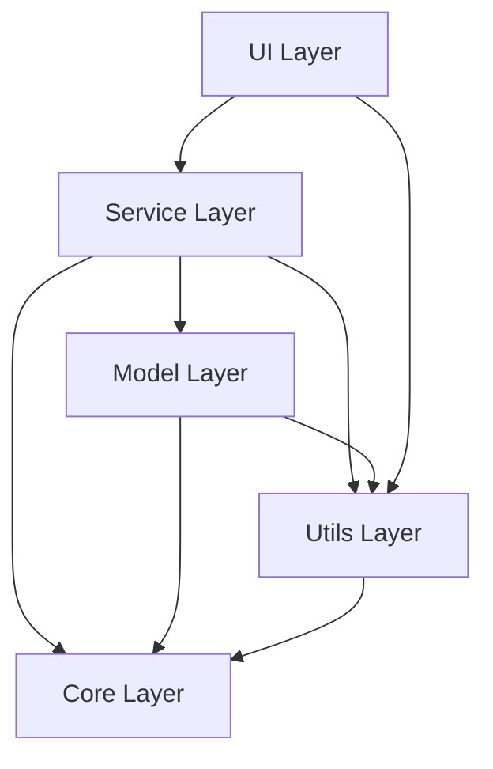

# VidGen Project Structure & Architecture

This document provides a comprehensive overview of VidGen's project organization, migration status, and architectural decisions.

## 🏗️ Project Organization Philosophy

VidGen follows modern Python packaging standards with a clean separation of concerns:

### 📦 Package Structure Principles
- **Modular Design**: Each component has a single, well-defined responsibility
- **Dependency Injection**: Components receive their dependencies rather than creating them
- **Interface Segregation**: Small, focused interfaces rather than large monolithic ones
- **Error Boundaries**: Comprehensive error handling with graceful degradation
- **Testability**: Every component is designed to be easily testable in isolation

## 🔄 Migration Status & History

### Previous Structure (Legacy - Deprecated)
The original VidGen implementation used a flat file structure:

```
VidGen/ (Legacy - Now in legacy/ folder)
├── app.py          # Monolithic application with UI
├── agent.py        # Script parsing logic
├── models.py       # All AI models in one file
├── assemble.py     # Video assembly functions
├── config.py       # Global configuration
└── data_models.py  # Data structures
```

**Issues with Legacy Structure**:
- ❌ Tight coupling between components
- ❌ Difficult to test individual features
- ❌ Hard to extend with new functionality
- ❌ No clear separation of UI, business logic, and data
- ❌ Limited error handling and recovery

### Current Structure (Modern Package Design)

```
src/vidgen/
├── 🔧 core/                 # Foundation Layer
│   ├── __init__.py          # Package exports
│   ├── config.py            # Centralized configuration
│   └── exceptions.py        # Custom exception hierarchy
├── 🤖 models/               # Model Layer (AI/ML)
│   ├── __init__.py          # Model exports
│   ├── audio.py             # Audio generation & processing
│   ├── image.py             # Image generation with SD
│   ├── tts.py               # Text-to-speech synthesis
│   ├── video.py             # Video effects & transitions
│   ├── data_models.py       # Pydantic data models
│   └── model_utils.py       # Model utilities & optimization
├── 🔄 services/             # Service Layer (Business Logic)
│   ├── __init__.py          # Service exports
│   ├── script_parser.py     # Script analysis & segmentation
│   ├── video_generator.py   # Main video generation pipeline
│   ├── video_assembler.py   # Multi-track video assembly
│   └── gemini_api.py        # External API integration
├── 🖥️ ui/                   # Presentation Layer
│   ├── __init__.py          # UI exports
│   ├── gradio_app.py        # Web interface implementation
│   └── components.py        # Reusable UI components
└── 🛠️ utils/                # Utility Layer
    ├── __init__.py          # Utility exports
    ├── file_manager.py      # File system operations
    ├── logging_config.py    # Logging & progress tracking
    └── helpers.py           # Common utility functions
```

## 📋 Migration Checklist Status

### ✅ Completed Migrations

| Component | Legacy File | New Location | Status | Benefits |
|-----------|-------------|--------------|--------|----------|
| **Configuration** | `config.py` | `src/vidgen/core/config.py` | ✅ Complete | Centralized settings, environment variables |
| **Script Parsing** | `agent.py` | `src/vidgen/services/script_parser.py` | ✅ Complete | Better error handling, JSON validation |
| **Image Generation** | `models.py` | `src/vidgen/models/image.py` | ✅ Complete | Memory optimization, caching |
| **TTS Generation** | `models.py` | `src/vidgen/models/tts.py` | ✅ Complete | Voice consistency, quality improvements |
| **Video Generation** | `models.py` | `src/vidgen/models/video.py` | ✅ Complete | Professional transitions, effects |
| **Audio Generation** | `models.py` | `src/vidgen/models/audio.py` | ✅ Complete | Procedural synthesis, mixing |
| **API Integration** | `app.py` | `src/vidgen/services/gemini_api.py` | ✅ Complete | Rate limiting, error recovery |
| **Video Assembly** | `assemble.py` | `src/vidgen/services/video_assembler.py` | ✅ Complete | Multi-track support, overlays |
| **Main Application** | `app.py` | `src/vidgen/main.py` | ✅ Complete | Async processing, progress tracking |
| **Data Models** | `data_models.py` | `src/vidgen/models/data_models.py` | ✅ Complete | Pydantic validation, type safety |
| **UI Components** | `app.py` | `src/vidgen/ui/gradio_app.py` | ✅ Complete | Modular components, better UX |

### 🆕 New Components (Not in Legacy)

| Component | Location | Purpose | Features |
|-----------|----------|---------|----------|
| **Exception Handling** | `src/vidgen/core/exceptions.py` | Error management | Recovery suggestions, user-friendly messages |
| **Model Utilities** | `src/vidgen/models/model_utils.py` | AI model optimization | Memory management, caching, GPU optimization |
| **File Manager** | `src/vidgen/utils/file_manager.py` | File operations | Safe file handling, temp cleanup, backup |
| **Logging System** | `src/vidgen/utils/logging_config.py` | Monitoring | Progress tracking, structured logging |
| **Video Generator** | `src/vidgen/services/video_generator.py` | Pipeline orchestration | High-level API, workflow management |
| **UI Components** | `src/vidgen/ui/components.py` | Reusable UI elements | Modular interface components |
| **Helper Functions** | `src/vidgen/utils/helpers.py` | Common utilities | Shared functionality across modules |

## 🏛️ Architectural Patterns

### 1. Layered Architecture
```
┌─────────────────────────────────────────┐
│              UI Layer                    │ ← User Interface (Gradio)
├─────────────────────────────────────────┤
│           Service Layer                  │ ← Business Logic
├─────────────────────────────────────────┤
│            Model Layer                   │ ← AI/ML Models
├─────────────────────────────────────────┤
│             Core Layer                   │ ← Configuration & Exceptions
└─────────────────────────────────────────┘
```

### 2. Dependency Flow
- **UI** depends on **Services**
- **Services** depend on **Models** and **Core**
- **Models** depend on **Core**
- **Utils** support all layers

### 3. Error Handling Strategy
```python
# Decorator-based error recovery
@with_error_recovery
def risky_operation():
    # Operation that might fail
    pass

# Exception hierarchy with recovery suggestions
try:
    generate_video()
except VidGenError as e:
    print(f"Error: {e}")
    print(f"Suggestion: {e.recovery_suggestion}")
```

## 🧪 Testing Architecture

### Test Organization
```
tests/
├── 🔧 test_core/            # Core functionality tests
│   ├── test_config.py       # Configuration testing
│   ├── test_exceptions.py   # Error handling tests
│   └── test_error_handling.py # Recovery mechanism tests
├── 🤖 test_models/          # Model layer tests
│   ├── test_audio.py        # Audio generation tests
│   ├── test_image.py        # Image generation tests
│   ├── test_tts.py          # TTS functionality tests
│   ├── test_video.py        # Video processing tests
│   └── test_video_enhanced.py # Advanced video features
├── 🔄 test_services/        # Service layer tests
│   ├── test_script_parser.py # Script parsing tests
│   ├── test_video_assembler.py # Video assembly tests
│   └── test_gemini_api.py   # API integration tests
├── 🛠️ test_utils/           # Utility tests
│   └── test_file_manager.py # File management tests
├── 🎯 test_integration.py   # End-to-end tests
└── 🔧 conftest.py          # Test configuration & fixtures
```

### Test Coverage Targets
- **Unit Tests**: >95% coverage for individual components
- **Integration Tests**: Complete pipeline coverage
- **Performance Tests**: Memory usage and speed benchmarks
- **Error Handling Tests**: All error paths covered

## 📊 Component Dependencies

### Internal Dependencies


### External Dependencies
```python
# AI/ML Dependencies
torch>=2.0.0           # Deep learning framework
transformers>=4.30.0   # Hugging Face models
diffusers>=0.20.0      # Stable Diffusion
bark>=1.0.0            # Text-to-speech

# Media Processing
ffmpeg-python>=0.2.0   # Video/audio processing
opencv-python>=4.8.0   # Computer vision
pillow>=10.0.0         # Image manipulation

# Web & APIs
gradio>=3.40.0         # Web interface
google-generativeai>=0.3.0 # Gemini API
requests>=2.31.0       # HTTP client

# Data & Validation
pydantic>=2.0.0        # Data validation
numpy>=1.24.0          # Numerical computing
```

## 🔮 Future Enhancements

### Planned Improvements
1. **Plugin System**: Extensible architecture for custom effects
2. **Distributed Processing**: Multi-GPU and cloud processing support
3. **Real-time Preview**: Live preview during generation
4. **Advanced AI Models**: Integration with newer models (GPT-4V, DALL-E 3)
5. **Mobile Support**: Responsive web interface for mobile devices

### Migration Roadmap
1. **Phase 1** ✅: Core architecture migration (Completed)
2. **Phase 2** ✅: Enhanced error handling and testing (Completed)
3. **Phase 3** 🔄: Performance optimization and caching (In Progress)
4. **Phase 4** 📋: Plugin system and extensibility (Planned)
5. **Phase 5** 📋: Cloud deployment and scaling (Planned)

## 🛠️ Development Guidelines

### Code Organization Rules
1. **Single Responsibility**: Each module has one clear purpose
2. **Interface Segregation**: Small, focused interfaces
3. **Dependency Inversion**: Depend on abstractions, not concretions
4. **Open/Closed Principle**: Open for extension, closed for modification

### Naming Conventions
- **Modules**: `snake_case` (e.g., `video_generator.py`)
- **Classes**: `PascalCase` (e.g., `VideoGenerator`)
- **Functions**: `snake_case` (e.g., `generate_video`)
- **Constants**: `UPPER_CASE` (e.g., `DEFAULT_RESOLUTION`)

### Import Guidelines
```python
# Standard library imports first
import os
import sys

# Third-party imports second
import torch
import gradio as gr

# Local imports last
from vidgen.core.config import Config
from vidgen.models.video import VideoModel
```

---

This architecture ensures VidGen remains maintainable, extensible, and testable as it grows in complexity and functionality.

For now, the project can still be run using the legacy entry points, but we recommend moving to the new structure:

```bash
# Legacy entry point
python app.py

# New entry point
python -m src.vidgen.main
```

## Testing

Tests are being written for the new structure:

```bash
# Run all tests
pytest tests/

# Run specific test category
pytest tests/test_models/
pytest tests/test_services/
```
